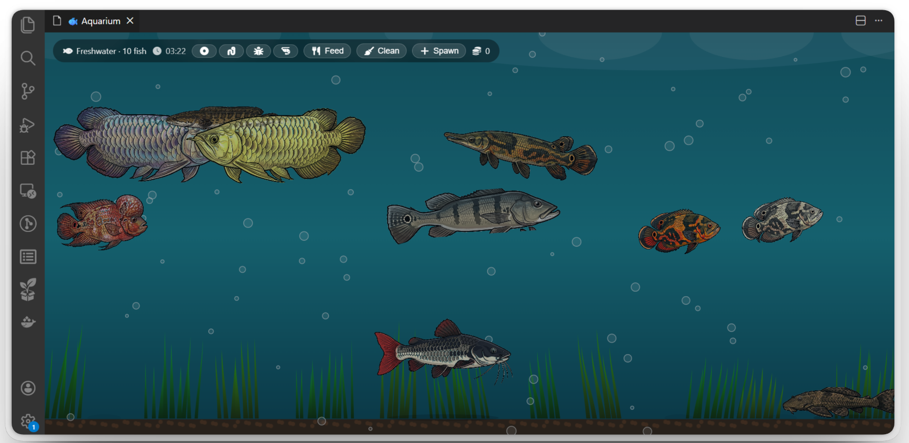

# VSCode Aquarium

A freshwater aquarium that lives inside your VS Code editor. Sprite-animated fish swim, feed, and grow while you code.



[](https://marketplace.visualstudio.com/items?itemName=jeffreybulanadi.vscodeaquarium)
[](https://marketplace.visualstudio.com/items?itemName=jeffreybulanadi.vscodeaquarium)
[](https://marketplace.visualstudio.com/items?itemName=jeffreybulanadi.vscodeaquarium)
[](LICENSE)
[](https://code.visualstudio.com)

---

## Overview

VSCode Aquarium is an interactive freshwater tank simulation that runs as a panel inside your editor. Fish have swim zones, feeding behaviors, and growth cycles that play out in real time while you work.

---

## Features

### Sprite-Animated Fish

- 7 freshwater species, each with unique swim zones, speeds, and diet preferences
- 3-section body wave animation: the whole spine undulates head-to-tail, not just the tail
- Smooth direction turns: fish squish naturally when reversing instead of snapping
- Per-species body flexibility: Arowana and Snakehead flex more, Pleco and Alligator Gar are stiff
- Multiple color variants per species (Silver / Red / Golden / Green Arowana, Tiger / Albino Oscar, etc.)

### Fish Behavior

- Fish grow hungry over time and need to be fed to stay healthy
- Each species prefers specific food types; matching preferences restores more hunger
- 4 food types available: Pellet, Superworm, Cricket, Shrimp
- Well-fed fish grow visibly larger, up to 150% of their base size
- Starved fish float belly-up and fade out
- Uneaten food leaves debris on the gravel floor

### Living Environment

- Swaying aquatic plants with procedural blade-by-blade animation
- Rising bubbles with organic sine-wave drift
- Animated water-surface light caustics
- Elliptical fish shadows on the gravel floor
- Day/Night cycle tied to your system clock (darkens at 20:00, lightens at 05:00)

### Controls and UI

- In-tank spawn panel: click the Add button to spawn fish without the Command Palette
- Live clock display synced to system time
- Click any fish for a tooltip: species, hunger level, size, mood, and preferred food
- Blinking hunger indicator above fish that need feeding
- Status bar item showing live fish count and coin total
- Responsive canvas that scales to any panel size

---

## Fish Roster

| Species | Variants | Swim Zone | Preferred Food |
|---|---|---|---|
| Arowana | Silver, Golden, Red, Green | Surface | Cricket, Shrimp |
| Oscar Cichlid | Tiger, Red, Albino | Mid-tank | Cricket, Superworm |
| Snakehead | Olive, Giant, Rainbow | Upper-mid | Cricket, Shrimp |
| Alligator Gar | Olive, Spotted, Albino | Top-mid | Superworm, Shrimp |
| Red-Tailed Catfish | Natural, Albino | Bottom | Superworm, Pellet |
| Pleco | Common, Royal, Gold Nugget | Gravel | Pellet |
| Flowerhorn Cichlid | Red Dragon, Golden, Kamfa, Blue | Mid-tank | Cricket, Superworm |

Peacock Bass is temporarily removed pending a higher-quality sprite.

---

## Getting Started

### Install

1. Open VS Code
2. Press `Ctrl+Shift+X` to open Extensions
3. Search **VSCode Aquarium**
4. Click Install

The aquarium opens automatically on startup with a default tank containing Arowana and Oscar.

### Feeding

| Action | How |
|---|---|
| Drop food at a position | Click anywhere on the canvas |
| Drop food at center | Use the Feed button in the HUD |
| Command Palette | `Aquarium: Feed Fish` |
| Change food type | Click the food icons in the HUD |

### Tank Management

| Action | How |
|---|---|
| Spawn a fish | Click Add in the HUD, then pick species and color variant |
| Add via Command Palette | `Aquarium: Add Fish` |
| Remove all fish | `Aquarium: Remove All Fish` |
| Clean tank debris | Click the Clean button (5-minute cooldown) |
| Switch tank type | `Aquarium: Switch Aquarium Type (Fresh/Salt)` |
| Toggle auto-open | `Aquarium: Toggle Auto-open on Startup` |

### Fish Tooltip

Click any fish to see:

- Species name
- Hunger level (0 = full, 100 = starving)
- Size scale (100% to 150%)
- Current mood
- Preferred foods

---

## Configuration

Edit via File, Preferences, Settings or directly in `settings.json`:

```json
{
  "aquarium.type": "freshwater",
  "aquarium.autoOpen": true,
  "aquarium.fish": [
    { "species": "arowana",    "colorVariant": "silver" },
    { "species": "oscar",      "colorVariant": "tiger"  },
    { "species": "oscar",      "colorVariant": "albino" }
  ]
}
```

| Setting | Type | Default | Description |
|---|---|---|---|
| `aquarium.type` | string | `"freshwater"` | `"freshwater"` or `"saltwater"` |
| `aquarium.autoOpen` | boolean | `true` | Open aquarium on every VS Code launch |
| `aquarium.fish` | array | 3 defaults | Fish in your tank |

---

## Commands

| Command | Description |
|---|---|
| `Aquarium: Open Aquarium` | Open or re-focus the aquarium panel |
| `Aquarium: Add Fish` | Choose a species and color variant to add |
| `Aquarium: Remove All Fish` | Empty the tank |
| `Aquarium: Feed Fish` | Drop pellets at center |
| `Aquarium: Switch Aquarium Type` | Toggle freshwater or saltwater |
| `Aquarium: Toggle Auto-open on Startup` | Enable or disable auto-open |

---

## Performance

- 60 FPS target via `requestAnimationFrame`
- Background gradient pre-baked to an offscreen canvas; only the shimmer layer redraws each frame
- Sprite white-background removal runs once at load, result cached
- Each fish costs approximately 1-2% CPU at 60 FPS; recommended maximum is 8-10 fish

Tested on VS Code 1.75+ on Windows, macOS, and Linux.

---

## Development

### Prerequisites

- Node.js 16+
- TypeScript 5.3+
- VS Code 1.75+

### Build

```bash
npm install
npm run compile
npm run watch
```

Press F5 in VS Code to launch an Extension Host debug window.

### Project Structure

```
vscodeaquarium/
├── src/
│   └── extension.ts       # Extension host, webview creation, IPC
├── media/
│   ├── aquarium.js        # Canvas render loop, fish behavior, simulation
│   ├── aquarium.html      # Webview shell and spawn HUD
│   ├── aquarium.css       # Styling
│   ├── *.jpg / *.png      # Fish sprites
│   └── fontawesome.*      # Icon fonts
├── out/                   # Compiled JS (git-ignored)
├── package.json           # Extension manifest
└── tsconfig.json
```

### Architecture Notes

- Canvas 2D rendering, no WebGL dependency
- 3-section sprite animation: body clip, mid-posterior clip (rotated), tail clip nested in mid's frame, producing a seamless S-curve body wave
- `renderDir` float per fish: lerps from -1 to +1 at 10 units/s for smooth direction turns
- Webview IPC via `postMessage` for persistence of fish list and tank state
- Fish state stored in VS Code `settings.json`

---

## Roadmap

- Peacock Bass with high-quality sprite
- Saltwater species: Clownfish, Tang, Lionfish, Pufferfish, Marine Angel
- Tank decorations: rocks, driftwood, castles
- Fish territorial behavior

---

## Contributing

1. Fork and clone the repo
2. Run `npm install && npm run compile`
3. Press F5 to test in Extension Host
4. Submit a pull request

Bug reports and feature requests: [GitHub Issues](https://github.com/jeffreybulanadi/vscode-aquarium/issues)

---

## License

MIT. See [LICENSE](LICENSE).

---

## Credits

- Inspired by [vscode-pets](https://marketplace.visualstudio.com/items?itemName=tonybaloney.vscode-pets)
- Icons by [Font Awesome](https://fontawesome.com)
- Built with TypeScript and the VS Code Extension API
