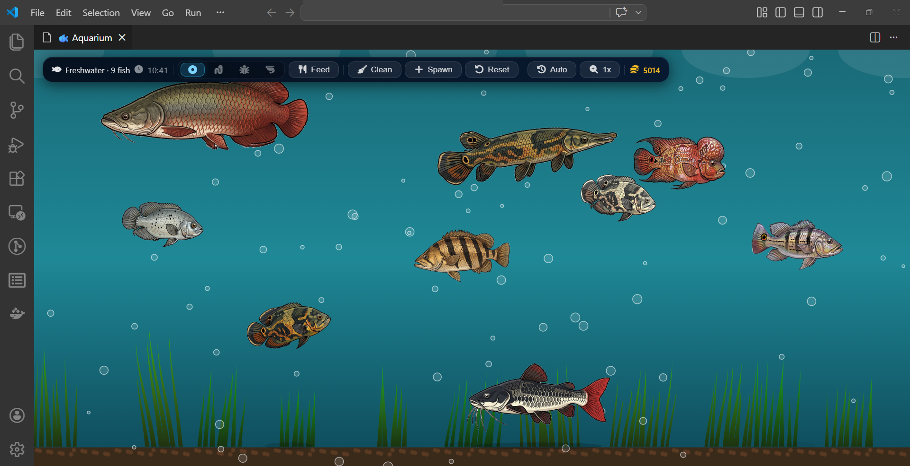
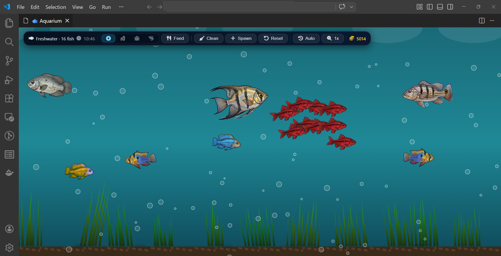
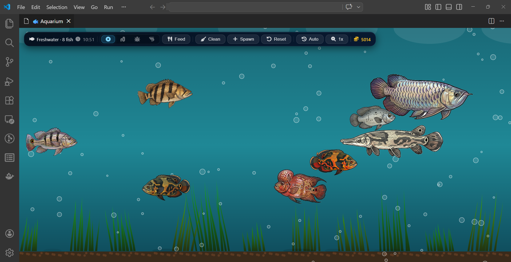

# VSCode Aquarium

A living freshwater aquarium inside your VS Code editor. Sprite-animated fish swim, feed, grow, school, patrol, and chase each other while you code.

[](https://marketplace.visualstudio.com/items?itemName=jeffreybulanadi.vscodeaquarium)
[](https://marketplace.visualstudio.com/items?itemName=jeffreybulanadi.vscodeaquarium)
[](https://marketplace.visualstudio.com/items?itemName=jeffreybulanadi.vscodeaquarium)
[](LICENSE)
[](https://code.visualstudio.com)






---

## Overview

VSCode Aquarium is an interactive freshwater tank simulation that runs as a panel inside VS Code. Fish have unique swim zones, feeding behaviors, growth cycles, species-specific movement patterns, and predator-prey interactions that play out in real time while you work.

---

## Fish Roster

| Species | Variants | Swim Zone | Diet | Behavior |
|---|---|---|---|---|
| Arowana | Silver, Golden, Red, Green | Surface | Cricket, Shrimp | Surface breach, speed burst |
| Arapaima | Natural, Gold, Juvenile | Surface–upper | Cricket, Shrimp | Predator chase |
| Oscar Cichlid | Tiger, Red, Albino | Mid-tank | Cricket, Superworm | Territorial patrol |
| Snakehead | Olive, Giant, Rainbow | Upper-mid | Cricket, Shrimp | Predator chase |
| Alligator Gar | Olive, Spotted, Albino | Top-mid | Superworm, Shrimp | Predator chase |
| Iridescent Shark | Natural, Juvenile, Albino | Mid-tank | Pellet, Cricket | Schooling |
| Red-Tailed Catfish | Natural, Albino | Bottom | Superworm, Pellet | Bottom forager |
| Pleco | Common, Royal, Gold Nugget | Gravel | Pellet | Substrate parking |
| Flowerhorn Cichlid | Red Dragon, Golden, Kamfa, Blue | Mid-tank | Cricket, Superworm | Territorial patrol |
| Peacock Bass | Standard, Gold | Mid-tank | Cricket, Shrimp | Territorial patrol |
| Knifefish | Dark, Albino | Lower-mid | Superworm, Shrimp | Slow glider |
| Silver Dollar | Silver | Mid-tank | Pellet, Superworm | Schooling |
| Tilapia | Standard | Mid-tank | Pellet, Cricket | Steady swimmer |
| Indonesian Tiger | Standard | Mid-tank | Cricket, Shrimp | Predator chase |
| Electric Blue Ram | Standard, Longfin | Lower-mid | Pellet, Shrimp | Territorial patrol, flees predators |
| German Ram | Natural, Female, Gold | Bottom | Pellet, Shrimp | Territorial patrol |
| Diamond Stingray | Standard | Bottom | Superworm, Pellet | Bottom glider |
| Cherry Barb | Red, Standard | Mid-tank | Pellet, Cricket | Schooling, flees predators |
| Angelfish | Standard, Black | Mid-tank | Cricket, Superworm | Steady swimmer |

---

## Features

### Species-Specific Behaviors

Each species has distinct movement patterns beyond basic swimming:

- **Schooling** - Cherry Barb, Silver Dollar, and Iridescent Shark form coordinated groups using Boids logic (separation, alignment, cohesion). The school scatters naturally when a predator approaches.
- **Territorial patrol** - Oscar, Flowerhorn, Peacock Bass, Electric Blue Ram, and German Ram slowly patrol a home zone instead of roaming freely.
- **Arowana surface breach** - roughly every 60-80 seconds, the Arowana surges toward the water surface and settles back down, mimicking real hunting behavior.
- **Arowana speed burst** - occasional horizontal dash every 25-45 seconds, independent of the breach.
- **Pleco substrate parking** - pleco periodically parks motionless on the tank floor, simulating its natural sucker-mouth resting posture.
- **Predator-prey chase** - Arowana, Arapaima, Alligator Gar, Snakehead, and Indonesian Tiger lock onto nearby Cherry Barb or Electric Blue Ram and charge. Both predator and prey alternate cruise and sprint burst speeds. The chase ends after a few seconds and both fish decelerate naturally. Purely cosmetic: no fish are harmed.

### Sprite Animation

- 3-section body wave: the whole spine undulates head-to-tail, not just the tail
- Smooth direction turns: fish squish naturally when reversing instead of snapping
- Per-species body flexibility: Arowana and Snakehead flex more, Pleco and Alligator Gar are stiff
- Multiple color variants per species
- Full-resolution sprites scaled by the GPU for sharpness at any VS Code zoom level

### Hunger and Growth System

- Fish grow hungry over time (2-3 hours to starve)
- Each species prefers specific food types; matching preferences restores more hunger
- 4 food types: Pellet, Superworm, Cricket, Shrimp
- Well-fed fish grow visibly larger, up to 150% of their base size
- Starved fish float belly-up and fade out
- Uneaten food leaves debris on the gravel floor

### Living Environment

- Swaying aquatic plants with procedural blade-by-blade animation
- Rising bubbles with organic sine-wave drift
- Animated water-surface light caustics
- Elliptical fish shadows on the gravel floor
- Day/Night cycle tied to your system clock (darkens at 20:00, lightens at 05:00)

### Controls and UI

- In-tank spawn panel: click the Add button to choose species and color variant; fish grouped by biological category
- Live clock display synced to system time
- Premium HUD: deep ocean glassmorphism styling with teal accents and hover-glow buttons
- Click any fish for a canvas tooltip: species name, hunger level, size, mood, and preferred food — with fade-in/fade-out animation and a teal accent bar
- Hover any HUD button for a styled CSS tooltip (replaces plain browser tooltips)
- Blinking hunger indicator above fish that need feeding (orange at 45%+, red at 75%+)
- Status bar item showing live fish count and coin total
- 20-fish tank limit with a visible indicator when the tank is full
- Responsive canvas that scales to any panel size

---

## Getting Started

### Install

1. Open VS Code
2. Press `Ctrl+Shift+X` to open Extensions
3. Search **VSCode Aquarium**
4. Click Install

The aquarium opens automatically on startup with an empty tank. Use the Add button or Command Palette to stock your fish.

### Feeding

| Action | How |
|---|---|
| Drop food at a position | Click anywhere on the canvas |
| Drop food at center | Use the Feed button in the HUD |
| Command Palette | `Aquarium: Feed Fish` |
| Change food type | Click the food icons in the HUD |

### Tank Management

| Action | How |
|---|---|
| Spawn a fish | Click Add in the HUD, then pick species and color variant |
| Add via Command Palette | `Aquarium: Add Fish` |
| Remove all fish | `Aquarium: Remove All Fish` or click Reset |
| Clean tank debris | Click the Clean button (5-minute cooldown) |
| Switch tank type | `Aquarium: Switch Aquarium Type (Fresh/Salt)` |
| Toggle auto-open | `Aquarium: Toggle Auto-open on Startup` |

### Fish Tooltip

Click any fish to see:

- Species name
- Hunger level (0 = full, 100 = starving)
- Size scale (100% to 150%)
- Current mood
- Preferred foods

---

## Configuration

Edit via File, Preferences, Settings or directly in `settings.json`:

```json
{
  "aquarium.type": "freshwater",
  "aquarium.autoOpen": true,
  "aquarium.fish": [
    { "species": "arowana",    "colorVariant": "silver" },
    { "species": "cherrybarb", "colorVariant": "red"    },
    { "species": "oscar",      "colorVariant": "tiger"  }
  ]
}
```

| Setting | Type | Default | Description |
|---|---|---|---|
| `aquarium.type` | string | `"freshwater"` | `"freshwater"` or `"saltwater"` |
| `aquarium.autoOpen` | boolean | `true` | Open aquarium on every VS Code launch |
| `aquarium.fish` | array | `[]` (empty) | Fish in your tank |

---

## Commands

| Command | Description |
|---|---|
| `Aquarium: Open Aquarium` | Open or re-focus the aquarium panel |
| `Aquarium: Add Fish` | Choose a species and color variant to add |
| `Aquarium: Remove All Fish` | Empty the tank |
| `Aquarium: Feed Fish` | Drop pellets at center |
| `Aquarium: Switch Aquarium Type` | Toggle freshwater or saltwater |
| `Aquarium: Toggle Auto-open on Startup` | Enable or disable auto-open |

---

## Performance

- 30 FPS cap via `requestAnimationFrame` with timestamp throttle
- Color variants pre-baked at startup: no per-frame canvas filter calls
- Background gradient pre-baked to an offscreen canvas; only the shimmer layer redraws each frame
- Sprite white-background removal runs once at load; result cached at full resolution
- Sprites capped at 512px height on load to reduce VRAM and speed up processing
- Rendering pauses automatically when the aquarium panel is not visible
- 20-fish hard limit; each fish costs approximately 1-2% CPU at 30 FPS

Tested on VS Code 1.75+ on Windows, macOS, and Linux.

---

## Development

### Prerequisites

- Node.js 16+
- TypeScript 5.3+
- VS Code 1.75+

### Build

```bash
npm install
npm run compile
npm run watch
```

Press F5 in VS Code to launch an Extension Host debug window.

### Project Structure

```
vscodeaquarium/
├── src/
│   └── extension.ts       # Extension host, webview creation, IPC
├── media/
│   ├── aquarium.js        # Canvas render loop, fish behavior, simulation
│   ├── aquarium.html      # Webview shell and spawn HUD
│   ├── aquarium.css       # Styling
│   ├── fish/              # Fish sprite images (JPG)
│   └── fontawesome.*      # Icon fonts
├── out/                   # Compiled JS (git-ignored)
├── package.json           # Extension manifest
└── tsconfig.json
```

### Architecture Notes

- Canvas 2D rendering, no WebGL dependency
- 3-section sprite animation: body clip, mid-posterior clip (rotated), tail clip nested in mid's frame, producing a seamless S-curve body wave
- `renderDir` float per fish: lerps from -1 to +1 at 10 units/s for smooth direction turns
- Boids schooling: separation, alignment, and cohesion forces blended with wander velocity
- Predator-prey state machine: cooldown, acquisition, chase with burst phases, give-up with velocity decay
- Webview IPC via `postMessage` for persistence of fish list and tank state
- Fish state stored in VS Code `globalState` (coins, growth) and `settings.json` (fish list)

---

## Roadmap

- Saltwater species: Clownfish, Tang, Lionfish, Pufferfish, Marine Angel
- Tank decorations: rocks, driftwood, castles
- More schooling species
- Fish interaction sounds (ambient underwater audio)

---

## Contributing

1. Fork and clone the repo
2. Run `npm install && npm run compile`
3. Press F5 to test in Extension Host
4. Submit a pull request

Bug reports and feature requests: [GitHub Issues](https://github.com/jeffreybulanadi/vscode-aquarium/issues)

---

## License

MIT. See [LICENSE](LICENSE).

---

## Credits

- Inspired by [vscode-pets](https://marketplace.visualstudio.com/items?itemName=tonybaloney.vscode-pets)
- Icons by [Font Awesome](https://fontawesome.com)
- Built with TypeScript and the VS Code Extension API
